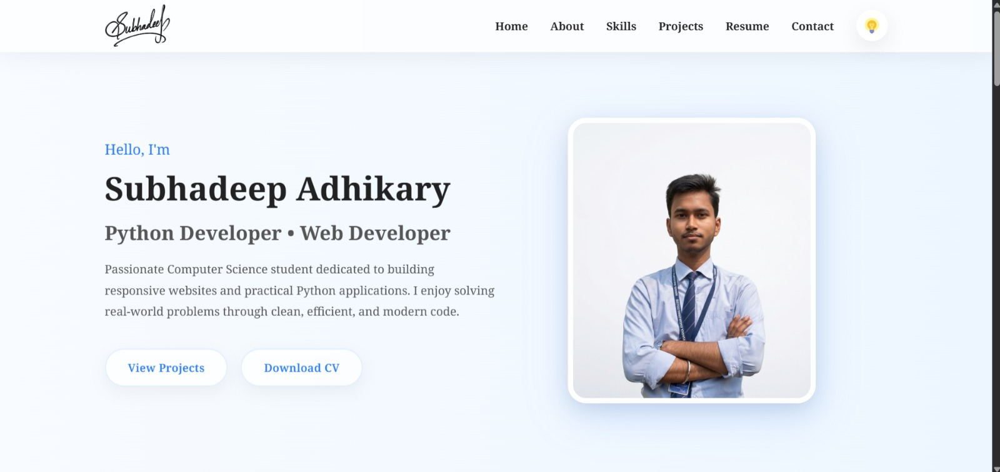

# 🌐 Personal Portfolio Website

A modern, responsive portfolio website built using **HTML**, **CSS**, and **JavaScript** to showcase my skills, projects, resume, and contact information.

---

## 📸 Portfolio Preview

<p align="center">
  
</p>

---

## 🚀 Live Demo

🌐 **Website:**

[Visit My Portfolio](https://subhadeep1357.github.io/my-portfolio/)

---

## 👨‍💻 About

Hello! I'm **Subhadeep Adhikary**, a passionate Computer Science and Engineering student at **Asansol Engineering College**, dedicated to building responsive web applications and continuously improving my software development skills.

This portfolio highlights my:

- 💼 Projects
- 💻 Technical Skills
- 📄 Resume
- 📬 Contact Information

The website was designed with a clean, modern, and responsive user interface to provide a professional online presence.

---

## ✨ Features

- Responsive Design
- Dual Theme (Light & Dark Mode)
- Smooth Scrolling
- Animated Sections
- Download Resume
- Project Showcase
- Contact Section
- Glassmorphism UI

---

## 🛠️ Technologies Used

- HTML5
- CSS3
- JavaScript
- Git
- GitHub
- GitHub Pages

---

## 📁 Project Structure

```
my-portfolio/
│
├── image/
├── icons/
├── resume/
├── index.html
├── style.css
├── script.js
└── README.md
```

---

## 📬 Contact

**Subhadeep Adhikary**

📧 Email

[iot23.subhadeepadhikary.31@gmail.com](mailto:iot23.subhadeepadhikary.31@gmail.com)

💼 LinkedIn

[linkedin.com/in/subhadeepadhikary](https://www.linkedin.com/in/subhadeepadhikary)

---

## ⭐ Repository

If you found this project useful, please consider giving it a ⭐ on GitHub.

---

## 📄 License

This project is available for learning and personal inspiration.

© 2026–Present Subhadeep Adhikary. All rights reserved.
